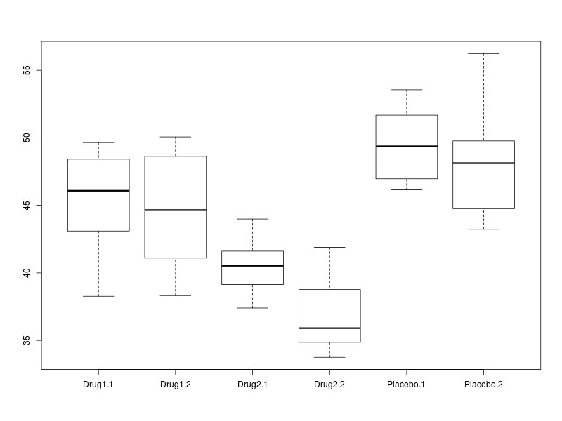

# [Course Home](http://bioinformatics-core-shared-training.github.io/r-intermediate/)

# Overview of this section

- tidy data
    + what it means
    + how to create it
- **`select`** and **`mutate`** verbs in dplyr
- advice for cleaning strings and dates


> Like families, tidy datasets are all alike but every messy dataset is messy in its own way - (Hadley Wickham)

http://vimeo.com/33727555

http://vita.had.co.nz/papers/tidy-data.pdf

# Tidy Data

Tidy data are important because they are an entry point for the *analysis cycle* we will describe during the course.


As we saw, our data, and especially data we might find out "in the wild", may need "cleaning"" before we can use it. We will discuss how to clean our data for analysis. However, there are steps you can take to make sure your data are tidy and organised before importing into R.

- [Karl Broman's tutorial on Data Organisation](http://kbroman.org/dataorg/)
- ["Data Carpentry" workshop](http://lgatto.github.io/2016-05-16-CAM/)


## The data frame

The data frame object in R allows us to work with "tabular" data, like we might be used to dealing with in Excel, where our data can be thought of having rows and columns. The values in each column have to all be of the same type (i.e. all numbers or all text).


The `iris` data frame is a [classic dataset](https://en.wikipedia.org/wiki/Iris_flower_data_set) that is built into R. To load these data, we tidy the variable name `iris` (notice no quotation marks) in brackets. This dataset is also a good example of data in the tidy form.

N.B. As we will see later, we tend to read datasets into R using `read.csv`, `read.delim` or similar functions.

```{r}
iris
```

The `View` function will create a tab in RStudio that we can use to browse the data.

```{r eval=FALSE}
View(iris)
```

The following will create a boxplot of the values in `Sepal.Length` column categorised into the different values of `Species`. Such a plot allows us to look for differences in mean between different groups, and also assess the variability of the data.

```{r}
boxplot(iris$Sepal.Length~iris$Species)
```


An *analysis of variance* (ANOVA) analysis can also tell us if the differences between the groups are statistically significant

```{r}
mod <- aov(iris$Petal.Length~iris$Species)
anova(mod)
```

## Example (from tidyr paper)

Consider the following....

Name          | treatmenta | treatmentb
------------- | -----------|-----------
John Smith    |    -       |    2
Jane Doe      |    16      |    11 
Mary Johnson  |    3       |    1


Data in this format are quite familiar to us, but not easily-interpret able by the computer. We need to think of the dataset in terms of *variables* and *values*. In this example dataset we have *18* values and *3* variables

1. Person (John, Jane or Mary)
2. Treatment (A or B)
3. "Result"

The guiding principles:

- Each column is a variable
- Each row is an observation
- Each type of observational unit forms a table

The tidy form of this data thus becomes;

Name          | Treatment  | Result
------------- | -----------|-----------
John Smith    |    a       |    -
Jane Doe      |    a       |    16 
Mary Johnson  |    a       |    3
John Smith    |    b       |    2
Jane Doe      |    b       |    11
Mary Johnson  |    b       |    1

We can read these data from the file `tidyr-example.txt`

```{r}
untidy <- read.delim("tidyr-example.txt")
untidy
```


## Using tidyr to tidy a dataset

`gather` is a function in the `tidyr` package that can collapse multiple columns into key-value pairs. 

- similar to `stack` in base R
- or `melt` in the `reshape` / `reshape2` packages

The arguments to `gather` are;

- the data frame you want to manipulate
- the name of the *key* column you want to create
- the name of the *value* column you want to create
- the *names* of the columns in the data frame that are to be collapsed
    + note you don't need "" to define the column names
        

```{r warning=FALSE}
library(tidyr)
gather(untidy, Treatment, Result, treatmenta, treatmentb)
```

(*Ideally, the `Treatment` column should just be `a` or `b`, but we'll see how to change this later-on*)

When specifying columns, an alternative is to ignore some column names

```{r warning=FALSE}
gather(untidy, Treatment, Result, -Name)
```

Can also specify column index

```{r warning=FALSE}
gather(untidy, Treatment, Result, 2:3)
```

Note that after all these operations, the original data frame (`untidy`) is unaltered

  - we need to create a new variable to save the result
  - you should never work directly on the raw data

```{r warning=FALSE}
untidy
tidy <- gather(untidy, Treatment, Result, treatmenta, treatmentb)
```

******

## Exercise: Simulated clinical data

Lets read some typical data from a clinical trial.

- Each patient was given a number of different treatments; Placebo, and two different drugs
    + Two replicates of each
- Some kind of measurement was performed to assess the effect of the drug
- Overall question is the effect of the treatment 

```{r,warning=FALSE}
messyData <- read.delim("clinicalData.txt")
messyData
```


- What variables and observations do we have?
- What might a 'tidy' version of the dataset look like?
- Can you make the following boxplot to visualise the effect of the different treatments?



  
```{r}
### Your answer here...

```

******

## Other useful functions in 'tidyr'

`tidyr` has a few more useful functions that we can demonstrate on the `tidyData` object you should have just created

- `spread` has the opposite effect to `gather` and will translate tidy data back into human-readable form
    + arguments are the *Key* and *Value* columns in the tidy data frame
- `separate` can be used to split column names that are comprised by two different parts with a common separating character. e.g. `Drug1.1`, `Drug1.2` etc.
    + it should be able to guess that a `.` character is being used to join the two different parts of the name together
    + we can explicitly say the separator being used. Apart from the `.` in our example other common values are `-`, `_`, `:`.

```{r}
## Example of spread and separate

```


# dplyr: select and mutate

We are going to explore some of the basic features of `dplyr` using some patient data; the kind of data that we might encounter in the wild. However, rather than using real-life data we are going to make some up. There is a package called `wakefield` that is particularly convenient for this task.

Various patient characteristics have been generated and saved in the file [patient-data.txt](patient-data.txt). 

```{r}
patients <- read.delim("patient-data.txt")
```


In Rstudio , you can view the contents of this data frame in a tab.

```{r eval=FALSE}
View(patients)
```


Using `dplyr`, `patients` can be converted to a special kind of data frame; the `tbl_df`. The main difference is that the whole data frame does not get printed to screen. All operations that we could do on a data frame can be applied to a `tbl_df`.

N.B. This conversion is not really necessary when run R code interactively in an R notebook

```{r message=FALSE}
library(dplyr)
patients <- tbl_df(patients)
patients
```


The `tbl_df` function in dplyr creates a new object with more-convenient default display

- The object behaves in exactly the same way as a data frame
- `glimpse` can be used to get a snapshot of your data
    + similar to `str` function in base R

```{r}
glimpse(patients)
```


***We are planning a study that will involve overweight smokers. So one of our first task is to identify a list of candidates. ***

## Selecting variables; the `select` verb

As we mentioned, `dplyr` introduces a series of ***verbs*** that can be used to operate on our data. The first we will introduce is *`select`*


The default display of a `tbl_df` object is to print the data frame in an intelligent manner, so not to flood the R console. If we want to control what variables are printed we can use the `select` function, which allows us to print certain columns to the screen.


We should be familiar with how to extract columns from a data frame with a `$` symbol. 

  - Remember that we're not changing the data frame, just exploring it

```{r}
patients$Name
```

The `$` operator works fine for single columns, but for multiple columns it quickly gets a bit messy as we have to resort to using `[]`

```{r}
patients[,c("Name","Race")]
```

Non R users probably find these commands a bit obtuse

- why the `[ ]`?
- what is `c`?
- need to remember the row and column index
- `[,...]` means display all rows

However, `select` is a lot more intuitive; easier understand from reading the code

- *"Select the Name column from patients"*
    + Notice the lack of `""`

```{r}
select(patients, Name)
```

*"Select the Name and Race columns"*

```{r}
select(patients, Name, Race)
```

Excluding certain columns in base R would require us to know the *index* we wanted to exclude, or to do something complicated with the column names.

```{r eval=FALSE}
patients[,-2]
patients[,setdiff(colnames(patients), "Name")]
```

Compare to dplyr version....*"Select all columns apart from Name"*

```{r}
select(patients, -Name)
```

Similarly easier to get columns within a particular range. *"Select all columns between Name and Sex"*

```{r}
select(patients, Name:Sex)
```

Say we cannot remember the name of the column

```{r}
select(patients, starts_with("Grade"))
```

see also

- `contains()`, `matches()`, `ends_with()`

******
## Exercise: select

- Print all the columns between `Height` and `Grade_Level`
- Print all the columns between `Height` and `Grade_Level`, but NOT `Pet`
- Print the columns `Height` and `Weight`
    + try to do this without specifying the full names of the columns
- (OPTIONAL)
- Print the columns in alphabetical order
- Print all the columns whose name is less than 4 characters in length

There are several ways to solve these. Feel free to explore

```{r}
### Your answer here, or in 2.dplyr-intro-exercises.Rmd ## 

```


******


## Transforming / cleaning variables


We can now begin to explore the data. Imagine that we want to do a simple barplot to the number of males and females. Using base graphics, we can do this with;

- We will see `ggplot2` later which is a more natural way of plotting after manipulating our data with `dplyr`

```{r}
barplot(table(patients$Sex))
```

But something seems to be wrong with the number of categories that are produced. 

- What base functions can we use to print the variable as a character string and print the number of characters?

```{r}
### Print the variable as a character string and show the number of characters in each entry ###
patients$Sex
nchar(as.character(patients$Sex))
```

The base distribution of R has many functions for dealing with strings. However, the `stringr` package (again from Hadley Wickham) aims to provide a clean modern interface to many common string operations. In a similar way, `lubridate` provides a convenient interface to deal with date information.

Of particular interest here is the `str_trim` (`?str_trim`) function that will trim *whitespace* from a vector of strings. Arguments can be used to specify whether to remove whitespace from either side of the string, or just the left or right. 

```{r}
library(stringr)
str_trim(patients$Sex)
```

Once we have worked-out how to created a cleaned version of the variable, we need to update the data frame. This can be done using the next of the **dplyr verbs**; `mutate`.

## Modifying or creating variables: the `mutate` verb

`mutate` allows us to compute and append one or more new columns to a data frame. We can specify a new column name, or overwrite an existing one. 

```{r}
mutate(patients, Sex2 = str_trim(Sex))
mutate(patients, Sex = str_trim(Sex))
```

As above, we do not change the data frame so need to create a new variable if we want the changes to persist. 

```{r}
patients_clean <- mutate(patients, Sex = factor(str_trim(Sex)))
patients_clean
```


We might want to look at the distribution of heights amongst our patients. However, if we try this we are immediately hit with an error message

```{r eval=FALSE}
hist(select(patients,Height))
```

The problem is that R thinks that values are not numbers. Why might that be?

```{r}
select(patients,Height)
```

To convert the values back to numbers we first need to remove the `"cm"` at the end of each value. We can do this with a *string replacement* operation. In this case, the particular string we want to put in the place of `"cm"` is the *empty string* `""`. The replacement can be done using the `str_replace_all` function.


```{r}
mutate(patients_clean, Height= str_replace_all(Height,pattern = "cm",""))
```

Note that the input to this function is the `patients_clean` object that we created previously. 

However, what do you notice about the class reported for the Height column after this operation. 

- compare to the `Count` column, for example

We need an extra conversion step to make sure these are represented as *numeric* values.

```{r}
patients_clean <- mutate(patients_clean, Height= as.numeric(str_replace_all(Height,pattern = "cm","")))
hist(patients_clean$Height)
```

Finally, you can also modify/create more than one column within a single `mutate()`. 
For example our two cleaning steps above (for `Sex` and `Height`), could have 
been done as:

```{r}
patients_clean <- mutate(patients, 
                         Sex = factor(str_trim(Sex)),
                         Height= as.numeric(str_replace_all(Height,pattern = "cm","")))
```

Other useful functions from `stringr`, and the `lubridate` package, are described after the exercise. If time allows, we will go through these in the class. If you finish the exercise early, feel free to take a look.

## Exercise: Cleaning the patients data
- See [Rmarkdown template](2.dplyr-intro-exercises.Rmd)
- For a follow-on study, we are interested in overweight smokers
    + clean the `Smokes` column to contain just `TRUE` or `FALSE` values
- We need to calculate the Body Mass Index (BMI) for each of our patients
- $BMI = (Weight) / (Height^2)$ 
    + where Weight is measured in Kilograms, and Height in Metres
- A BMI of 25 is considered overweight, calculate a new variable to indicate which individuals are overweight
- (EXTRA) What other problems can you find in the data?

```{r}
library(tidyr)
library(stringr)
library(dplyr)

# Re-read and clean the data if you haven't yet
patients <- read.delim("patient-data.txt")
patients_clean <- mutate(patients, 
                         Sex = factor(str_trim(Sex)),
                         Height= as.numeric(str_replace_all(Height,pattern = "cm","")))

## Your answer here or 2.dplyr-intro-exercises.Rmd

```


# Supplementary:

***If times allows, here are some other useful functions for dealing with strings and dates***

Rather than removing whitespace, sometimes we might want to adjust a set of strings so that they have a fixed width. We can do this be adding a *padding* character to each string if necessary. This operations is often done with a set of identifiers.

```{r}
str_pad(patients$ID,pad = "0",width=15)
patients_clean <- mutate(patients_clean, ID=str_pad(ID,pad = "0",width=15))
```

Note that we can perform several operations in the same command.

```{r}
patients_clean <- mutate(patients, Sex = factor(str_trim(Sex)),ID=str_pad(ID,pad = "0",width=15))
```


Similarly, we might want to trim all the strings between a particular start and end position

```{r}
str_sub(patients$ID, 1,2)
str_sub(patients$ID, 4,5)
```

Finally, we can convert entire strings to upper- or lower-case
  - `str_to_title` is also handy as it gives a string that has the first letter in upper-case, all others in lower-case

```{r}
str_to_lower(patients$Pet)
str_to_upper(patients$Name)
str_to_title(patients$Name)
```

## Filling in missing values

If a column contains lots of consecutive entries that are repeated, it is tempted to leave the repeated entries blank and their values can be inferred from an entry higher up in the column. The `Date.Entered.Study` column is an example of such a column. As humans, we can quickly ascertain the dates that patients 2 to 9 were enrolled onto the study. However, as it stands we would not be able to perform filtering to identify the patients that enrolled on a certain date because some entries are blank.

```{r}
select(patients_clean, ID,Name,Date.Entered.Study)
```

Fortunately, the `tidyr` package has a very useful function called `fill` that will fill either up or down in a specified column. We first have to convert the column into a character and replace the blank strings with an `NA`.

```{r}
library(tidyr)
## Currently missing values are represented as a blank string
patients_clean$Date.Entered.Study == ""
## Turn the column into a character
patients_clean <- mutate(patients_clean, Date.Entered.Study = as.character(Date.Entered.Study))
## Replace the blank strings with an NA
patients_clean <- mutate(patients_clean, Date.Entered.Study = ifelse(Date.Entered.Study == "", NA,Date.Entered.Study))
## Now fill will happily fill the missing values for us
patients_clean <- fill(patients_clean,Date.Entered.Study)
select(patients_clean, ID,Name,Date.Entered.Study)
```


## Dealing with dates

Dates are often problematic as they may be encoded in lots of different schemes

If we wanted the year in which each person was born it would be tempting to *trim* the first four characters of the string. However, getting the month or day might be a bit more problematic as we cannot always rely on the same encoding being used.

```{r}
str_sub(patients$Birth,1,4)
```

The `lubridate` package has lots of useful functions for dealing with dates (also by Hadley Wickham!). For example it allows the year, month and day to be extracted.

```{r warning=FALSE}
library(lubridate)
year(patients$Birth)
month(patients$Birth)
```

It also supports some clever manipulation, such as being able to subtract and add times.

```{r}

dob <- ymd(patients$Birth)
today <- ymd("20160509")
age <- interval(dob, today) 
as.period(age)

patients_clean <- mutate(patients_clean, Age = year(as.period(age)))
patients_clean
```
