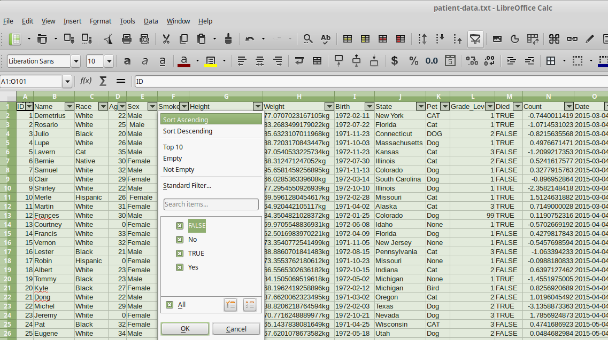

# [Course Home](http://bioinformatics-core-shared-training.github.io/r-intermediate/)

# Overview of this section

- Introducing piping
- **filter** verb
- **arrange** verb


We've ended up with a long chain of steps to perform manipulations on our data. It is quite common to nest commands in R into a single line;

```{r}
head(read.delim("patient-data.txt"))
```

we read as

> apply the `head` function to the result of reading the file `patient-data.txt`

Could also do the same for our `mutate` statements, although this would quickly become convoluted..

> remove the cm characters from the Height variable of the data frame created by trimming white space from the sex variable from the patients data frame

```{r message = FALSE}
library(dplyr)
library(stringr)
patients <- read.delim("patient-data.txt")
patients_clean <- mutate(mutate(patients, Sex = factor(str_trim(Sex))),
                         Height = str_replace_all(patients$Height, pattern = "cm", ""))
```

We always have to work out what the first statement was, and work forwards from that.

- the arguments to a function are far-away from the function call

Alternatively, we could write each command as a separate line

```{r}
patients_clean <- mutate(patients, Sex = factor(str_trim(Sex)))
patients_clean <- mutate(patients_clean, Height = str_replace_all(Height, pattern = "cm", ""))
```


- prone to error if we copy-and paste
- notice how the output of one line is the input to the following line


# Introducing piping

The output of one operation gets used as the input of the next

In computing, this is referring to as *piping*

- unix commands use the `|` symbol


- the `magrittr` library implements this in R
    + this library is automatically loaded with `dplyr`

## Simple example

> read the file `patient-data.txt` ***and then*** use the `head` function

- Use the special function ` %>% ` at the end of the line
- Shortcut in RStudio: CTRL + SHIFT + M, CMD + SHIFT + M (Mac)
- We don't need to add any arguments to `head`
+ The first argument is the output from the previous line

```{r}
read.delim("patient-data.txt") %>%
  head()
```

The `read.delim` function produces a *data frame* as an output, and the `head` function only has one argument (a data frame). All the `dplyr` verbs that we will discuss today can be pipelined with ` %>% ` as they take a data frame as input, and produce a data frame as output.

We can write the following to print the first ten lines of a file;

```{r}
read.delim("patient-data.txt") %>%
  head(10)
```


We can re-write our data cleaning steps from the previous section with;

```{r}
patients_clean <- read.delim("patient-data.txt") %>%
  tbl_df %>%
  mutate(Sex = factor(str_trim(Sex))) %>%
  mutate(Height = as.numeric(str_replace_all(Height, pattern = "cm", "")))

patients_clean
```

> read the file `patient-data.txt` ***and then*** use the `tbl_df` function ***and then*** trim the whitespace from the Sex variable ***and then*** replace cm with blank characters in the Height variable

Note that we didn't need to specify `patients_clean` as an argument to the `mutate` function

- it as assumed that the output of one line acts as the first argument to the next line
- we don't need to create temporary variables


## Exercise: Re-writing a workflow using pipes

******
- Take the steps used to clean the patients dataset and calculate BMI... (see below or in `3.workflows-exercises.Rmd` for the code)
```{r}
patients <- read.delim("patient-data.txt")
patients <- tbl_df(patients)
patients_clean <- mutate(patients, Sex = factor(str_trim(Sex)))
patients_clean <- mutate(patients_clean, Height = as.numeric(str_replace_all(patients_clean$Height, pattern = "cm", "")))
patients_clean <- mutate(patients_clean, Weight = as.numeric(str_replace_all(patients_clean$Weight, "kg", "")))
patients_clean <- mutate(patients_clean, BMI = (Weight/(Height/100)^2), Overweight = BMI > 25)
patients_clean <- mutate(patients_clean, Smokes = str_replace_all(Smokes, "Yes", "TRUE"))
patients_clean <- mutate(patients_clean, Smokes = as.logical(str_replace_all(Smokes, "No", "FALSE")))
```

- Re-write in the piping framework


```{r}
## Your answer here or 3.workflows-exercises.Rmd

```


******

Now that we have cleaned the data we want to extract rows of interest from the data frame.

# Restricting rows: The `filter` verb


The **`filter`** verb is used to choose rows from the data frame. The criteria we use to choose can use the comparison operators `==`, `>`, `<`, `!=`

e.g. choose all the males

```{r}
filter(patients_clean, Sex == "Male")
```

In base R, we would do

```{r}
patients_clean[patients_clean$Sex == "Male",]
```

Again, to non R-users, this is less intuitive. However, the result is the same.

We can also use `!` to reverse the values in a logical vector and check for values that do not equal a particular value

```{r}
filter(patients_clean, Sex != "Female")
```


The `%in%` function can check for matches in a pre-defined vector

```{r}
filter(patients_clean, Pet %in% c("CAT", "Cat")) %>% select(ID, Name, Race, Pet)
```
(*additional `select` statement added so you can see the `Pet` variable`*)

Partial matches can be performed using `str_detect()` from the `stringr` package 
(there is a similar function in base R called `grepl`). This returns a logical 
(`TRUE` and `FALSE`) referring to whether the pattern was found or not

```{r}
str_detect(patients_clean$Name, "Br")
filter(patients_clean, str_detect(Name, "Br"))
```

Combining conditions in `filter` can be achieved adding `,` or using the Boolean operators `|`, `&`. In fact, the `&` isn't required and we can add extra conditions by separating them with a `,`.


```{r}
patients_clean %>% filter(Sex == "Male" & Died) %>% select(ID, Name, Race, Sex, Died)
patients_clean %>% filter(Sex == "Male", Died) %>% select(ID, Name, Race, Sex, Died)
```

The code in base R is more verbose and less easy to read.

```{r}
patients_clean[patients_clean$Sex == "Male" & patients_clean$Died, c("ID", "Name", "Race", "Sex", "Died")]
```

Height more than 160 *or* Weight greater than 74

```{r}
filter(patients_clean, Height > 160 | Weight > 74)
```

Height more than 160 *or* Weight greater than 74 *and* Female

```{r}
filter(patients_clean, Height > 160 | Weight > 74, Sex == "Female")
```

******
## Exercise: filter

Use `filter` to print the following subsets of the dataset

***N.B. each is a different subset of the data; we're not looking for a subset that fulfills all the conditions!***

  - Choose the Female patients from New York or New Jersey
  - Choose the overweight smokers that are still alive
  - Choose the patients who own a Pet that is not a dog
    + recall that `is.na` can check for values that are `NA`
  - (OPTIONAL)
  - Patients born in June
    + you could check out the notes on dealing with dates in the previous section for this
  - Patients with a Number > 100
    + Patient Number is the third component of the ID variable
    + e.g. `AC/AH/001` is patient Number 1; `AC/AH/017` is patient Number 17
  - Patients that entered the study on 2016-05-31
    + the column containing this data is incomplete; blank entries are assumed to be the same as the last non-blank entry above
    + the function `fill` from `tidyr` will help here

Feel free to experiment with different ways to do these

```{r}

## Your answer here or 3.workflows-exercises.Rmd

```


******
## Finalising the workflow

We now have all the tools in place in order to retrieve the overweight smokers from our dataset.

- An additional step might be to write the filtered data frame out to a file.
- Recall that functions `write.table`, `write.csv` are used to write a data frame to a tab-delimited or csv file.
    + Because these functions accept a data frame as their first argument, they fit easily into the pipeline framework as the last step.
    + as always the `.csv` will be written to your *working directory*
+ we never have to create a variable for our data

N.B. we also add an extra rounding to the BMI values so they display a bit nicer

```{r, eval = FALSE}
read.delim("patient-data.txt") %>%
  tbl_df %>%
  mutate(Sex = factor(str_trim(Sex))) %>%
  mutate(Height = as.numeric(str_replace_all(Height, pattern = "cm", ""))) %>%
  mutate(Weight = as.numeric(str_replace_all(Weight, "kg", ""))) %>%
  mutate(BMI = round(Weight/(Height/100)^2, 1), Overweight = BMI > 25) %>%
  mutate(Smokes = str_replace_all(Smokes, "Yes", "TRUE")) %>%
  mutate(Smokes = as.logical(str_replace_all(Smokes, "No", "FALSE"))) %>%
  select(ID, Birth, BMI, Smokes, Overweight, Died) %>%
  filter(Smokes & Overweight & !Died) %>%
  write.csv("candidates.csv")
```


# Ordering rows: The `arrange` verb



A related verb, that works on the rows of the table, is called **`arrange`**. You may have seen that we can use `order` in base R to re-order tables. Again, `arrange` is more intuitive.

Lets say we want to sort our patients by height;

```{r}
arrange(patients_clean, Height)
```

Can specify descending order using `desc`

```{r}
arrange(patients_clean, desc(Height))
```

Can use multiple variables in the sorting

e.g. `Grade_Level` and then `Count`

```{r}
arrange(patients_clean, desc(Grade_Level), Count) %>% select(ID:Sex,  Grade_Level,  Count)
```

`Grade_Level`, `Sex` and then `Count`

```{r}
arrange(patients_clean, desc(Grade_Level), Sex, Count) %>% select(ID:Sex,  Grade_Level,  Count)
```

A related function is `top_n`
- Although it does not seem to guarentee the results will be ordered

```{r}
top_n(patients_clean,  10,  Height) %>% arrange(Height)
top_n(patients_clean,  10,  Weight) %>% arrange(Weight)
```

With the workflow we have developed in the previous exercises, we can add extra steps to arrange and then select the candidates with the highest BMI prior to writing to a file.

```{r, eval = FALSE}
read.delim("patient-data.txt") %>%
  tbl_df %>%
  mutate(Sex = factor(str_trim(Sex))) %>%
  mutate(Height = as.numeric(str_replace_all(Height, pattern = "cm", ""))) %>%
  mutate(Weight = as.numeric(str_replace_all(Weight, "kg", ""))) %>%
  mutate(BMI = round(Weight/(Height/100)^2, 1), Overweight = BMI > 25) %>%
  mutate(Smokes = str_replace_all(Smokes, "Yes", "TRUE")) %>%
  mutate(Smokes = as.logical(str_replace_all(Smokes, "No", "FALSE"))) %>%
  select(ID, Birth,  BMI,  Smokes, Overweight,  Died) %>%
  filter(Smokes & Overweight & !Died) %>%
  arrange(desc(BMI)) %>%
  top_n(10, BMI) %>%
  write.csv("candidates.csv")
```

The downside with such pipelines is that they can be problematic to debug

- Best to build the pipeline step-by-step and check the output at each stage

# Re-usable pipelines

Imagine we have a second dataset that we want to process; `cohort-data.txt`.

This time we have around 10,000 patients, and shouldn't really be dealing with these data in Excel. However, once we have defined a pipeline on our smaller dataset, we can see how it scales to the new data

- In practice, we would probably want to check the output at each stage

```{r}
read.delim("cohort-data.txt") %>%
  tbl_df %>%
  mutate(Sex = factor(str_trim(Sex))) %>%
  mutate(Weight = as.numeric(str_replace_all(Weight, "kg", ""))) %>%
  mutate(Height = as.numeric(str_replace_all(Height, pattern = "cm", ""))) %>%
  mutate(BMI = round(Weight/(Height/100)^2, 1), Overweight = BMI > 25) %>%
  mutate(Smokes = as.logical(str_replace_all(Smokes, "Yes", "TRUE"))) %>%
  mutate(Smokes = as.logical(str_replace_all(Smokes, "No", "FALSE"))) %>%
  filter(Smokes & Overweight) %>%
  select(ID, Birth, BMI, Smokes, Overweight)  %>%
  arrange(desc(BMI)) %>%
  write.table("study-candidates.csv")
```

As the file is quite large, we might want to switch to `readr` for smarter and faster reading

- `readr` is another *tidyverse* package for data science

```{r message = FALSE}
library(readr)
read_tsv("cohort-data.txt") %>%
  tbl_df %>%
  mutate(Sex = factor(str_trim(Sex))) %>%
  mutate(Weight = as.numeric(str_replace_all(Weight, "kg", ""))) %>%
  mutate(Height = as.numeric(str_replace_all(Height, pattern = "cm", ""))) %>%
  mutate(BMI = round(Weight/(Height/100)^2, 1), Overweight = BMI > 25) %>%
  mutate(Smokes = as.logical(str_replace_all(Smokes, "Yes", "TRUE"))) %>%
  mutate(Smokes = as.logical(str_replace_all(Smokes, "No", "FALSE"))) %>%
  filter(Smokes & Overweight) %>%
  select(ID, Birth, BMI, Smokes, Overweight)  %>%
  arrange(desc(BMI)) %>%
  write.table("study-candidates.csv")
```

We might also want to make our cut-off for overweight a variable

```{r message = FALSE}
oWeightCutOff <- 25

library(readr)
read_tsv("cohort-data.txt") %>%
  tbl_df %>%
  mutate(Sex = factor(str_trim(Sex))) %>%
  mutate(Weight = as.numeric(str_replace_all(Weight, "kg", ""))) %>%
  mutate(Height = as.numeric(str_replace_all(Height, pattern = "cm", ""))) %>%
  mutate(BMI = round(Weight/(Height/100)^2, 1), Overweight = BMI > oWeightCutOff) %>%
  mutate(Smokes = as.logical(str_replace_all(Smokes, "Yes", "TRUE"))) %>%
  mutate(Smokes = as.logical(str_replace_all(Smokes, "No", "FALSE"))) %>%
  filter(Smokes & Overweight) %>%
  select(ID, Birth, BMI, Smokes, Overweight)  %>%
  arrange(desc(BMI)) %>%
  write.table("study-candidates.csv")
```


# Summary

In the past two sections we have introduced the concept of pipelines and various verbs in dplyr that will help us to manipulate our data

- select; for selecting columns
- mutate; for adding new columns
- filter; for restricting rows
- arrange; for ordering rows

We can use these in any order we like to create a workflow.

- When faced with a dataset, we should asked ourselves what steps we want to perform.
- The piping facility in R should allow us to express the workflow in a way that is intuitive and easy-to-read


