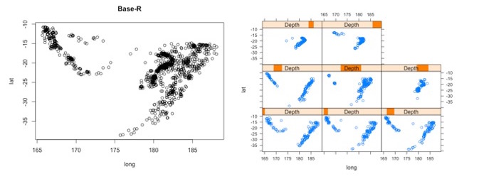
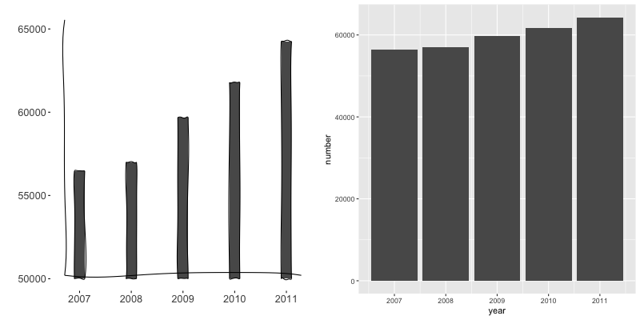
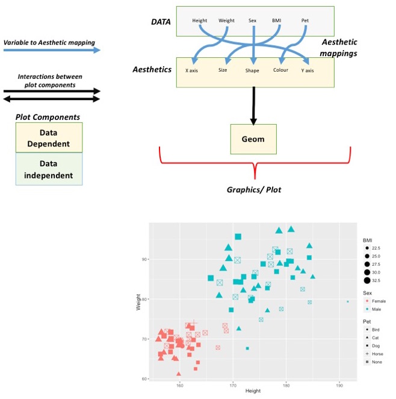

```{r echo=FALSE, include=FALSE}
knitr::opts_chunk$set(echo = TRUE)
library(tidyverse) # includes ggplot2
```


# Graphics in R

The R language has extensive graphical capabilities.

Graphics in R may be created by many different methods including base graphics
and more advanced plotting packages such as lattice.



The ggplot2 package was created by Hadley Wickham and provides a intuitive
plotting system to rapidly generate publication quality graphics.

ggplot2 builds on the concept of the "Grammar of Graphics" (Wilkinson 2005,
Bertin 1983) which describes a consistent syntax for the construction of a wide
range of complex graphics by a concise description of their components.


# Why use ggplot2

The structured syntax and high level of abstraction used by ggplot2 should
allow for the user to concentrate on the visualisations instead of creating the
underlying code.



But `ggplot2` will not advise on how best to visualise your data, and we will not discuss here

- See [Introduction to Scientific Figure Design](https://www.bioinformatics.babraham.ac.uk/training.html#figuredesign) by The Babraham Bioinformatics Core for more details
- [Top Simple Rules for Better Figures](http://journals.plos.org/ploscompbiol/article?id=10.1371/journal.pcbi.1003833)
- [And what not to do](http://www.businessinsider.com/the-27-worst-charts-of-all-time-2013-6?op=1&IR=T)

On top of this central philosophy ggplot2 has:

- Increased flexible over many plotting systems.
- An advanced theme system for professional/publication level graphics.
- Large developer base -- Many libraries extending its flexibility.
- Large user base -- Great documentation and active mailing list.


# Grammar of Graphics



Actual code for the ggplot2 scatter plot.

```{r eval=F}
ggplot(data = patients_clean,
       mapping = aes(y=Weight, x=Height, colour=Sex, size=BMI, shape=Pet)) +
    geom_point()
```


# Getting started with ggplot2

Earlier we have been working with the patients' dataset to create a "clean and
tidy" dataset.

Now we will use a cleaned dataset to demonstrate some of the plotting
capabilities of ggplot2.

```{r}
patients_clean = read.delim("patient-data-cleaned.txt",sep="\t")
head(patients_clean)
```

## Our first ggplot2 graph

As seen above, in order to produce a ggplot2 graph we need a minimum of:-

- Data to be used in graph
- Mappings of data to the graph (aesthetic mapping)
- What type of graph we want to use (The geom to use).

In the code below we define the data as our cleaned patients data frame.

Important information on how to map the data to the visual properties
(aesthetics) of the plot as well as what type of plot to use (geom) have
however yet to specified.

We then use the `geom_point()` function is used to specify a point plot, a
scatter plot of Height values on the x-axis versus Weight values on the y
values.

```{r}
p = ggplot(data=patients_clean) #+ aes(x=Height,y=Weight) #+ geom_point()
class(p)
head(p$data)
#p$mapping # inspect mappings
#p$theme
#p$layers
```

More typically, the data and aesthetics are defined within ggplot function and
geoms applied afterwards.

```{r}
ggplot(data=patients_clean,
       mapping=aes(x=Height,y=Weight)) + geom_point()
```


# Geoms - Plot types

As we have seen, an important element of a ggplot is the geom used. Following
the specification of data, the geom describes the type of plot used.

Several geoms are available in ggplot2:-

* `geom_point()` - Scatter plots
* `geom_line()` - Line plots
* `geom_smooth()` - Fitted line plots
* `geom_bar()` - Bar plots
* `geom_boxplot()` - Boxplots
* `geom_jitter()` - Jitter to plots
* `geom_histogram()` - Histogram plots
* `geom_density()` - Density plots
* `geom_text()` - Text to plots
* `geom_errorbar()` - Errorbars to plots
* `geom_violin()` - Violin plots

```{r}
p = ggplot(patients_clean, aes(x=Height, y=Weight)) # x and y are numeric
#p = ggplot(patients_clean, aes(x=Sex))              # factor (categorical) for x
#p = ggplot(patients_clean, aes(x=Sex, y=Weight))    # factor for x and numeric for y

p + geom_point()
#p + geom_line()
#p + geom_smooth()
#p + geom_bar()    # needs categorical x
#p + geom_histogram()
#p + geom_density()
#p + geom_boxplot() # categorical x + continuous y
#p + geom_violin()
```

An overview of geoms and thier arguments can be found at ggplot2 documentation
or within the ggplot2 cheatsheet.

-[ggplot2 documentation](http://docs.ggplot2.org/current/)

-[ggplot2 Cheatsheet](http://sape.inf.usi.ch/quick-reference/ggplot2/geom)


# Aesthetics

In order to change the property on an aesthetic of a plot into a constant value
(e.g. set colour of all points to red) we can supply the colour argument to the
`geom_point()` function.

As we discussed earlier however, ggplot2 makes use of aesthetic mappings to
assign variables in the data to the properties/aesthetics of the plot. This
allows the properties of the plot to reflect variables in the data dynamically.

In these examples we supply additional information to the `aes()` function to
define what information to display and how it is represented in the plot.

As we discussed earlier however, ggplot2 makes use of aesthetic mappings to
assign variables in the data to the properties/aesthetics of the plot. This
allows the properties of the plot to reflect variables in the data dynamically.

In these examples we supply additional information to the `aes()` function to
define what information to display and how it is represented in the plot.

```{r}
p = ggplot(patients_clean, aes(x=Height,y=Weight))

p + geom_point()
#p + geom_point(colour="red")
#p + geom_point(aes(color=Sex)) # can also add this to the plot object above
#p + geom_point(aes(color=Sex, shape=Smokes))
```

The aesthetic mappings may be set directly in the `geom_point()` function as
previously when specifying red. This can allow the same ggplot object to be
used by different aesethetic mappings and varying geoms

Again, for a comprehensive list of parameters and aesthetic mappings used in
`geom_*type*`  functions see the ggplot2 documentation for individual geoms by
using `?geom_*type*`.

```{r}
?geom_point
```

or visit the ggplot2 documentations pages and cheatsheet

- [ggplot2 documentation](http://docs.ggplot2.org/current/)

- [Cheatsheet](http://sape.inf.usi.ch/quick-reference/ggplot2/geom)


# Adding titles for plot and labels.

So far no plot titles have been specified. Plot titles can be specified using
the ggtitle and xlab/ylab functions.

```{r}
p = ggplot(patients_clean, aes(x=Height,y=Weight)) + geom_point()

p + ggtitle("Weight vs Height") + ylab("Height (cm)")
```

Alternatively, you can use the `labs` function.

```{r}
p = ggplot(patients_clean, aes(x=Height,y=Weight)) + geom_point()

p + labs(title="Weight vs Height",
         subtitle = "some explanation",
         caption = "data from source xyz",
         y="Height (cm)")
```


# Facets

One very useful feature of ggplot is faceting.  This allows you to produce
plots subset by variables in your data.

To facet our data into multiple plots we can use the `facet_wrap` or
`facet_grid` function specifying the variable we split by.

The `facet_grid` function is well suited to splitting the data by two factors.

Here we can plot the data with the Smokes variable as rows and Sex variable as
columns.

> facet_grid(Rows~Columns)

```{r}
p = ggplot(patients_clean, aes(x=Height,y=Weight,colour=Sex)) + geom_point()

p + facet_grid(Smokes~Sex) # rows ~ columns
#p + facet_grid(~Sex)       # ~ columns
#p + facet_grid(Sex~.)      # split along rows in plot
#p + facet_grid(Smokes~Sex+Pet)
#p + facet_grid(Smokes~Sex, scales="free_x")  # free_y, free
```

The `facet_wrap()` function offers a less grid based structure but is well
suited to faceting data by one variable.

For `facet_wrap()` we follow as similar syntax to `facet_grid()`

```{r}
p = ggplot(patients_clean, aes(x=Height,y=Weight,colour=Sex)) + geom_point()

p + facet_wrap(~Smokes)
#p + facet_wrap(~Pet+Smokes+Sex)
```

For more complex faceting both `facet_grid` and `facet_wrap` can accept
combinations of variables.


# Saving plots

Plots produced by ggplot can be saved from the interactive viewer as with
standard plots.

The ggsave() function allows for additional arguments to be specified including
the type, resolution and size of plot.

By default ggsave() will use the size of your current graphics window when
saving plots so it may be important to specify width and height arguments
desired. 

```{r}
p = ggplot(patients_clean, aes(x=Height,y=Weight)) + geom_point()

ggsave(p, filename="anExampleplot.png", width=15, height=15, units="cm")
```

# Change the plotting order in a boxplot

We will shortly discuss how to change various aspects of the plot layout and appearance. However, a common-asked question is how to change the order in which R plots a categorical variable. Consider the boxplot to compare weights of males and females:-

```{r}
ggplot(patients_clean, aes(x=Sex, y=Weight)) + geom_boxplot()
```

Here, R decides the order to arrange the boxes according to the `levels` of the categorical variable. By default this is the alphabetical order. i.e. Female before Male.

```{r}
patients_clean$Sex
```

Depending on the message we want the plot to convey, we might want control over the order of boxes. The `factor` functions allows us to explictly change the order of the levels.

```{r}
factor(patients_clean$Sex,levels=c("Male","Female"))
```

With the pipe syntax we just learnt about, we can change the variable on-the-fly and generate the plot 

```{r}
patients_clean %>% 
  mutate(Sex = factor(Sex,levels=c("Male","Female"))) %>% 
  ggplot(aes(x=Sex, y=Weight)) + geom_boxplot()
```

# Exercise set 1

[Link_to_exercises](ggplot2-exercises1.html)

[Link_to_exercises_with_images](ggplot2-exercises1-images.html)

[Link_to_Rmarkdown template](ggplot2-exercises1.Rmd)

[Link_to_answers](ggplot2-solutions1.html)


# Scales

Scales and their legends have so far been handled using ggplot2 defaults.
ggplot2 offers functionality to have finer control over scales and legends
using the *scale* methods.

Scale methods are divided into functions by combinations of 

* the aesthetics they control.

* the type of data mapped to scale.

  `scale_<aesthetic>_<type>`
  
  Try typing in `scale_` then `<tab>` to autocomplete. This will provide some
  examples of the scale functions available in ggplot2.

Although different `scale_` functions accept some variety in their arguments,
common arguments to scale functions include - 

- `name` - The axis or legend title

- `limits` - Minimum and maximum of the scale

- `breaks` - Label/tick positions along an axis

- `labels` - Label names at each break


## Controlling the X and Y scale.

Both continous and discrete X/Y scales can be controlled in ggplot2 using the
`scale_<x/y>_<continous/discrete>`

In this example we control the continuous sale on the x-axis by providing a
name, X-axis limits, the positions of breaks (ticks/labels) and the  labels to
place at breaks.

```{r}
p +
    geom_point() +
    facet_grid(Smokes~Sex)+
    scale_x_continuous(name="height ('cm')",
                       limits = c(100,200),
                       breaks=c(125,150,175),
                       labels=c("small","justright","tall"))
```

Similary control over discrete scales is shown below.

```{r}
p = ggplot(patients_clean, aes(x=Sex,y=Height))

p +
    geom_violin(aes(x=Sex,y=Height)) +
    scale_x_discrete(labels=c("Girls","Guys"))
```

Multiple X/Y scales can be combined to give full control of axis marks.

```{r}
p = ggplot(patients_clean,aes(x=Sex,y=Height,fill=Smokes))
p +
    geom_violin(aes(x=Sex,y=Height)) +
    scale_x_discrete(labels=c("Guys","Girls"))+
    scale_y_continuous(breaks=c(160,180),labels=c("Petite","Tall"))
```

## Controlling other scales.

When using fill,colour,linetype, shape, size or alpha aesthetic mappings the
scales are automatically selected for you and the appropriate legends created.

```{r}
p = ggplot(patients_clean,
           aes(x=Height, y=Weight, colour=Sex))
p + geom_point(size=4)
```

In the above example the discrete colours for the Sex variable was selected by
default.

### Manual discrete colour scale

Manual control of discrete variables can be performed using
`scale_*aes_Of_Interest*_manual` with the `values` parameter.  Additionally in
this example an updated name for the legend is provided.

```{r}
p = ggplot(patients_clean, aes(x=Height, y=Weight, colour=Sex))

p + geom_point(size=4) + 
    scale_color_manual(values = c("Green","Purple"), name="Gender")
```

### Colorbrewer for discrete colour scale

Here we have specified the colours to be used (hence the manual) but when the
number of levels to a variable are high this may be impractical and often we
would like ggplot2 to choose colours from a scale of our choice.

The brewer set of scale functions allow the user to make use of a range of
palettes available from colorbrewer.

- **Diverging**

 *BrBG, PiYG, PRGn, PuOr, RdBu, RdGy, RdYlBu, RdYlGn, Spectral*

- **Qualitative**

 *Accent, Dark2, Paired, Pastel1, Pastel2, Set1, Set2, Set3*

- **Sequential**

 *Blues, BuGn, BuPu, GnBu, Greens, Greys, Oranges, OrRd, PuBu, PuBuGn, PuRd,
 Purples, RdPu, Reds, YlGn, YlGnBu, YlOrBr, YlOrRd*


```{r}
p = ggplot(patients_clean, aes(x=Height,y=Weight,colour=Pet)) + geom_point(size=4)

p + scale_color_brewer(palette = "Set2")
```

For more details on palette sizes and styles visit the colorbrewer website and
ggplot2 reference page.

- [colorbrewer](http://colorbrewer2.org/)

- [ggplot2 colour scales](http://docs.ggplot2.org/current/scale_brewer.html)

### Continous colour scales

So far we have looked a qualitative scales but ggplot2 offers much
functionality for continuous scales such as for size, alpha (transparancy),
colour and fill.

- `scale_alpha_continuous()` - For Transparancy

- `scale_size_continuous()` - For control of size.


Both these functions accept the range of alpha/size to be used in plotting.

Below the range of alpha to be used in plot is limited to between 0.5 and 1

```{r}
p = ggplot(patients_clean, aes(x=Height, y=Weight, alpha=BMI)) + geom_point(size=4)
p + scale_alpha_continuous(range = c(0.5,1))

#p = ggplot(patients_clean, aes(x=Height, y=Weight, size=BMI)) + geom_point(alpha=0.8)
#p + scale_size_continuous(range = c(3,6))      # limit range between 3 and 6
#p + scale_size_continuous(range = c(3,6), limits = c(25,40))     # points outside limits are removed
#p + scale_size_continuous(range = c(3,6), breaks=c(25,30), labels=c("Good","Good but not 25"))
```

Control of colour/fill scales can be best achieved through the `gradient`
subfunctions of scale.

- `scale_(colour/fill)_gradient` - 2 colour gradient (eg. low to high BMI)

- `scale_(colour/fill)_gradient2` - Diverging colour scale with a midpoint
  colour (e.g. Down, No Change, Up)

Both functions take a common set of arguments:-

- `low` - Colour for low end of gradient scale
- `high` - Colour for high end of gradient scale.
- `na.value` - Colour for any NA values.

An example using `scale_colour_gradient` below sets the low and high end
colours to White and Red respectively. Similarly we can use the
`scale_colour_gradient2` function which allows for the specification of a
midpoint value and its associated colour.

```{r}
p = ggplot(patients_clean, aes(x=Height, y=Weight, color=BMI)) + geom_point(size=4,alpha=0.8)

p + scale_colour_gradient(low="White", high="Red")
#p + scale_colour_gradient2(low = "Blue", mid="Black", high="Red", midpoint = median(patients_clean$BMI)) # include midpoint
```

As with previous continous scales, limits and custom labels in scale legend can
be added.

```{r}
p = ggplot(patients_clean, aes(x=Height,y=Weight,colour=BMI)) + geom_point(size=4,alpha=0.8)

p + scale_colour_gradient1(low = "Blue",
                         mid="Black",
                         high="Red",
                         midpoint = median(patients_clean$BMI),
                         breaks=c(25,30),labels=c("Low","High"),
                         name="Body Mass Index")
```

Multiple scales may be combined to create high customisable plots and scales

```{r}
p = ggplot(patients_clean,
           aes(x=Height,y=Weight,colour=BMI,shape=Sex))

p + geom_point(size=4,alpha=0.8) +
    scale_shape_discrete(name="Gender") +
    scale_colour_gradient2(low = "Blue",
                           mid="Black",
                           high="Red",
                           midpoint = median(patients_clean$BMI),
                           breaks=c(25,30),labels=c("Low","High"),
                           name="Body Mass Index")
```


# Statistical transformations.

In ggplot2 many of the statistical transformations are performed without any
direct specification e.g. `geom_histogram()` will use `stat_bin()` function to
generate bin counts to be used in plot.

An example of statistical methods in ggplot2 which are very useful include the
`stat_smooth()` and `stat_summary()` functions.

The `stat_smooth()` function can be used to fit a line to the data being
displayed. Other methods available include lm, glm,gam,rlm.

```{r}
p = ggplot(patients_clean, aes(x=Weight,y=Height)) + geom_point()

p + stat_smooth()
#p + stat_smooth(method="lm")
```

A useful feature of ggplot2 is that it uses previously defined grouping when
performing smoothing.

If colour by Sex is an aesthetic mapping then two smooth lines are drawn, one
for each sex. This behaviour can be overridden by specifying an aes within the
`stat_smooth()` function and setting inherit.aes to FALSE.

```{r}
p = ggplot(patients_clean, aes(x=Weight,y=Height,colour=Sex)) + geom_point()

p + stat_smooth(method="lm")
#p + stat_smooth(aes(x=Weight,y=Height), method="lm", inherit.aes = FALSE)
```

Another useful method is `stat_summary()` which allows for a custom statistical
function to be performed and then visualised.

The fun.y parameter specifies a function to apply to the y variables for every
value of x.

In this example we use it to plot the quantiles of the Female and Male Height
data

```{r}
p = ggplot(patients_clean, aes(x=Sex, y=Height)) + geom_jitter()

p + stat_summary(fun.y=quantile, geom="point", colour="purple", size=8)
```

# Themes

Themes specify the details of data independent elements of the plot. This
includes titles, background colour, text fonts etc.

The graphs created so far have all used the default themes, `theme_grey()`, but
ggplot2 allows for the specification of theme used.

## Predefined themes

Predefined themes can be applied to a ggplot2 object using a family of
functions `theme_*style*()`

In the example below the minimal theme is applied to the scatter plot seen
earlier.

```{r}
p = ggplot(patients_clean, aes(x=Weight,y=Height)) + geom_point()

p + theme_minimal()
```

Several predifined themes are available within ggplot2 including:

- `theme_bw`
- `theme_classic`
- `theme_dark`
- `theme_gray`
- `theme_light`
- `theme_linedraw`
- `theme_minimal`

Packages such as [ggthemes](https://github.com/jrnold/ggthemes) also contain
many useful collections of predined `theme_*style*` functions.

## Creating your themes

As well as making use of predifened theme styles, ggplot2 allows for control
over the attributes and elements within a plot through a collection of related
functions and attributes.

`theme()` is the global function used to set attributes for the collections
of elements/components making up the current plot.

Within the theme functions there are 4 general graphic elements which may be
controlled:-

- `rect`
- `line`
- `text`
- `title`

and 5 groups of related elements:-

- `axis`
- `legend`
- `strip`
- `panel` (plot panel)
- `plot` (Global plot parameters)

These elements may be specified by the use of their appropriate element
functions including:

- `element_line()`
- `element_text()`
- `element_rect()`

and additionally `element_blank()` to set an element to "blank"

A detailed description of controlling elements within a theme can be seen at
the ggplot2 vignette and by typing `?theme` into the console.

- [ggplot2 themes](http://docs.ggplot2.org/dev/vignettes/themes.html)

To demonstrate customising a theme, in the example below we alter one element
of theme. Here we will change the text colour for the plot.

```{r}
p = ggplot(patients_clean, aes(x=Weight, y=Height)) + geom_point()

p + theme(text = element_text(colour="red"),
          axis.text = element_text(colour="red"))
```

- Note because we are changing a *text* element we use the `element_text()`
  function.

A detailed description of which elements are available and their associated
element functions can be found by typing `?theme`.

If we wished to set the y-axis label to be at an angle we can adjust that as
well.

```{r}
p = ggplot(patients_clean, aes(x=Weight, y=Height)) + geom_point()

p + theme(text = element_text(colour="red"),
          axis.text = element_text(colour="red"),
          axis.title.y = element_text(angle=0))
```

Finally we may wish to remove axis line, set the background of plot panels to
be white and give the strips (title above facet) a cyan background colour.

```{r}
p = ggplot(patients_clean, aes(x=Weight,y=Height)) + geom_point() + facet_grid(Sex~Smokes)

p + theme(text = element_text(colour="red"),
          axis.text = element_text(colour="red"),
          axis.title.y = element_text(angle=0),
          axis.line = element_line(linetype = 0),
          panel.background=element_rect(fill="white"),
          strip.background=element_rect(fill="cyan"))
```


# ggplot2 extensions

* [cowplot](https://cran.r-project.org/web/packages/cowplot/vignettes/introduction.html) for assembling figure panels
* [extension registry](http://www.ggplot2-exts.org/gallery/) for various extensions


# Exercise set 2

[Link_to_exercises](ggplot2-exercises2.html)

[Link_to_exercises_with_images](ggplot2-exercises2-images.html)

[Link_to_Rmarkdown template](ggplot2-exercises2.Rmd)

[Link_to_answers](ggplot2-solutions2.html)


# References.

- [Layered grammar of graphics](http://vita.had.co.nz/papers/layered-grammar.pdf)

- [ggplot2 documentation](http://docs.ggplot2.org/current/)

- [ggplot2 wiki](https://github.com/hadley/ggplot2/wiki)

- [ggplot2 mailing list](http://groups.google.com/group/ggplot2)

- [Cheatsheet](http://sape.inf.usi.ch/quick-reference/ggplot2/geom)

- [Even more material](http://tutorials.iq.harvard.edu/R/Rgraphics/Rgraphics.html)
