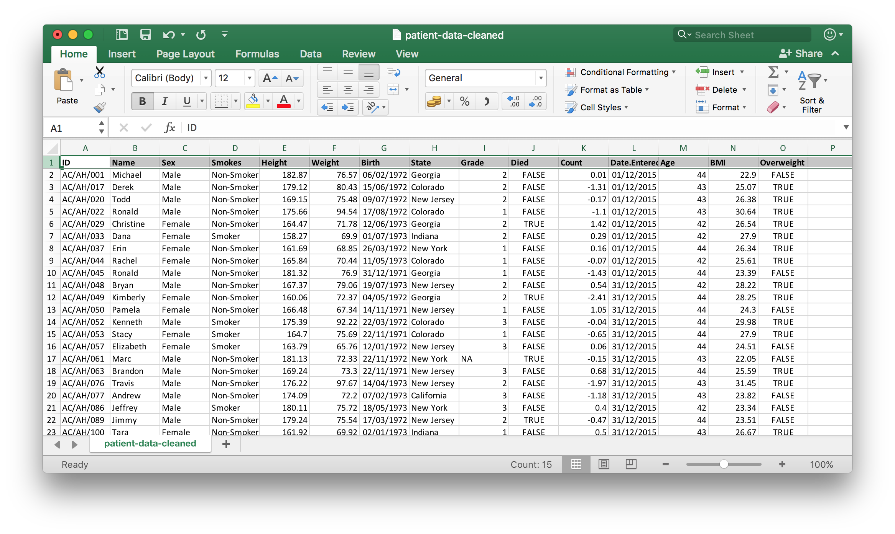

```{r setup, include = FALSE}
knitr::opts_chunk$set(echo = FALSE)
```

## What you will learn on this course

- How to clean "messy" datasets to make them more amenable to exploratory data analysis
<p>
- How to manipulate and transform tabular data in R using _**dplyr**_
<p>
- How to visualize data using the popular _**ggplot2**_ package


- Some of the _**Tidyverse**_ collection of R packages designed for data science

## Why not just use Excel?

Spreadsheets are a common entry point for many types of analysis and Excel is used widely **but**

<div style="line-height: 100%;"><br></div>

- can be unwieldy and difficult to deal with large amounts of data
<div style="line-height: 100%;"><br></div>
- error prone (e.g. gene symbols turning into dates)
<div style="line-height: 100%;"><br></div>
- tedious and time consuming to repeatedly process multiple files
<div style="line-height: 100%;"><br></div>
- how can you, or someone else, repeat what you did several months or years down the line?

## Aim of the course

The course aims to translate how we think of data in spreadsheets to a series of operations that can be performed and chained together in R

<br>


## The problem with R

There are **many hundreds (thousands!) of functions** for us to choose from to achieve our goals and everyone has their own set of favourites

_e.g. joining data from two data frames based on a common variable or key_

```{r echo = TRUE, eval = FALSE}
# base R
merge(x = df1, y = df2, by = "CustomerId", all.x = TRUE)

# data.table package
dt1 <- data.table(df1, key = "CustomerId") 
dt2 <- data.table(df2, key = "CustomerId")
dt1[dt2]

# plyr package
join(df1, df2, by = "CustomerId", type = "left")

# dplyr package
left_join(df1, df2, by = "CustomerId")
```

## The problem with R

There are **many hundreds (thousands!) of functions** for us to choose from to achieve our goals and everyone has their own set of favourites

<br>

_You know what you want to do but how do you find the right function to use?_

<br>

This course introduces an increasely popular set of tools that can help us to explore data in a consistent and pipeline-able manner

&nbsp;&nbsp;&nbsp;&nbsp;&rarr; the "**tidyverse**"

## Tidyverse tools covered in this course


<br>

- **readr** -- reading tabular data into a data frame in R
- **tidyr** -- tools for creating tidy data frames
- **dplyr** -- a consistent set of verbs for solving most data manipulation challenges
- **ggplot2** -- a system for declaratively creating plots based on the _Grammar of Graphics_
- **stringr** -- string matching, extraction, replacement and joining operations

## Course outline

Time            | Topic
----------------|---------------------------
9.30 --- 10.00  | **Introduction** (Matt) 
10.00 --- 11.00 | **Visualization with ggplot2** (Matt)
11.00 --- 11.45 | Exercise - ggplot2
11.45 --- 12.30 | **Tiding and transforming data** - tidyr intro and dplyr select, mutate (Sandra)
12.30 --- 1.30  | Lunch
1.30 --- 2.00   | Exercise - clean patient data
2.00 --- 3.00   | **Workflows** - piping and dplyr arrange, filter, including exercises (Anna)
3.00 --- 4.00   | **Summarizing, grouping and combining data**, including exercises (Anna/Sandra)
4.00 --- 5.00   | **Customizing plots** including exercise (Matt)

## How we teach the course

- "**Live coding**" in RStudio (no more slides!)
<div style="line-height: 150%;"><br></div>
- Exercises in R markdown documents combining narrative text and code chunks
<div style="line-height: 150%;"><br></div>
- Post-it notes
<div style="line-height: 150%;"><br></div>
- Feedback questionnaire
    - _Really does help us improve the course for next time_

## The Patients dataset



## Some data manipulations we will perform

- Cleaning and _**tidying**_ the very messy original form of the patients dataset
<div style="line-height: 100%;"><br></div>
- _**Selecting**_ a subset of columns to create a smaller data frame
<div style="line-height: 100%;"><br></div>
- Creating new columns (variables) from existing ones, e.g. calculating body mass index (BMI) from height and weight
<div style="line-height: 100%;"><br></div>
- _**Sorting**_ by specified variables
<div style="line-height: 100%;"><br></div>
- _**Filtering**_ rows (observations)
<div style="line-height: 100%;"><br></div>
- Chaining operations together in _**workflows**_
<div style="line-height: 100%;"><br></div>
- _**Grouping**_ and _**summarizing**_ observations, e.g. calculating mean BMI for smokers and non-smokers
<div style="line-height: 100%;"><br></div>
- _**Combining**_ data from two or more tables

## Some of the plots we will create

```{r message = FALSE}
library(readr)
library(ggplot2)
patients <- read_tsv("patient-data-cleaned.txt")
ggplot(data = patients, mapping = aes(x = Height, y = Weight)) +
  geom_point(mapping = aes(colour = Sex)) +
  geom_smooth(method = "lm") +
  scale_colour_brewer(palette = "Set1")
```

## Some of the plots we will create

```{r message = FALSE}
ggplot(data = patients, mapping = aes(x = Smokes, y = BMI, colour = Smokes)) +
  geom_boxplot() +
  geom_jitter(alpha = 0.4, width = 0.25) +
  facet_wrap(~ Sex) +
  scale_colour_brewer(palette = "Set1") +
  theme(legend.position = "none")
```

## Some of the plots we will create

```{r}
ggplot(data = patients, mapping = aes(x = BMI)) +
  geom_density(aes(fill = Smokes), alpha = 0.5) +
  scale_fill_brewer(palette = "Set1")
```

```{r}
detach("package:readr", unload = TRUE)
detach("package:ggplot2", unload = TRUE)
```

## Getting started

Install the tidyverse packages

```{r echo = TRUE, eval = FALSE}
install.packages("tidyverse")
```

<div style="line-height: 75%;"><br></div>

Load the core tidyverse packages

```{r echo = TRUE}
library(tidyverse)
```

## Reading the patients dataset into R

```{r echo = TRUE}
patients <- read_tsv("patient-data-cleaned.txt")
```

## Resources


- **Course website**<br>http://tinyurl.com/cruk-tidyr
<div style="line-height: 200%;"><br></div>
- **R for Data Science** book<br>http://r4ds.had.co.nz
<div style="line-height: 200%;"><br></div>
- Tidyverse website<br>https://www.tidyverse.org
<div style="line-height: 200%;"><br></div>
- **Cookbook for R** - Graphs section<br>http://www.cookbook-r.com/Graphs
<div style="line-height: 200%;"><br></div>
- RStudio **cheat sheets**<br>https://www.rstudio.com/resources/cheatsheets

