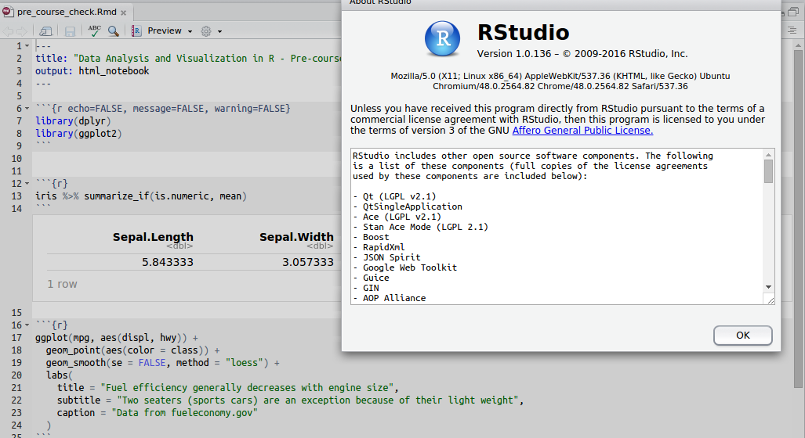
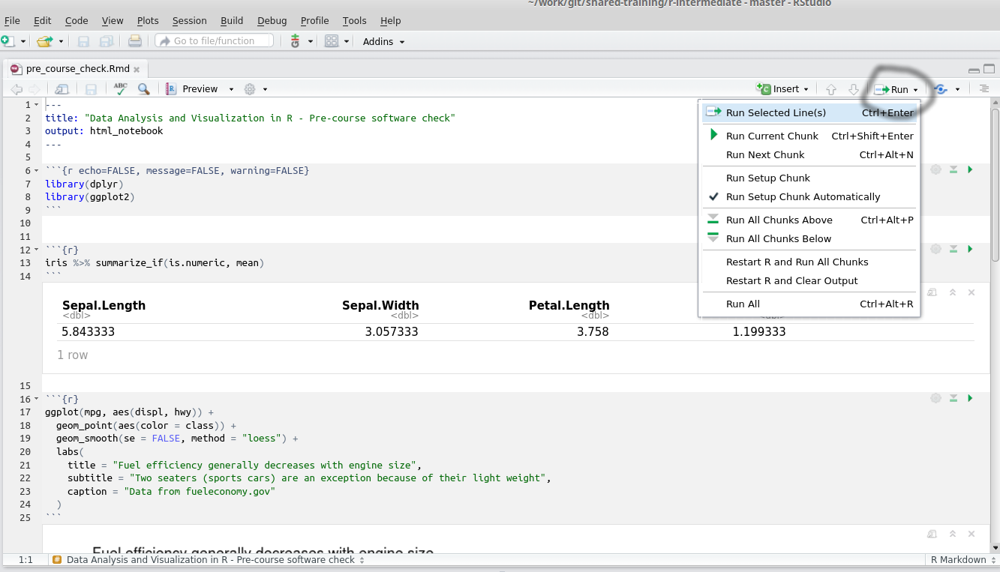
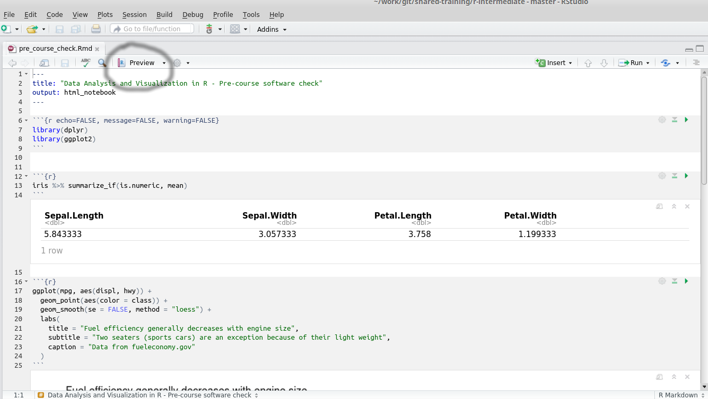

```{r setup, include=FALSE}
knitr::opts_chunk$set(echo = TRUE)
```

# Software Requirements for Data Manipulation and Visualisation in R

In order to run the course effectively, you will need the latest versions of R and RStudio. At the time of writing, the latest versions can be downloaded from the following links:-

## R

- R 3.3.3 for Mac OS X
    + https://cran.r-project.org/bin/macosx/R-3.3.3.pkg
- R 3.3.3 for Windows
    + https://cran.r-project.org/bin/windows/base/R-3.3.3-win.exe
    
## RStudio

- RStudio 1.0.136 for Mac OS X
    + https://download1.rstudio.org/RStudio-1.0.136.dmg
- RStudio 1.0.136 for Windows
    + https://download1.rstudio.org/RStudio-1.0.136.exe
    
## R Packages

You will need to install a number of R packages. To do this, open RStudio and copy-and-paste these lines of code at the R console:-

```{r eval=FALSE}
install.packages("devtools") 
devtools:::install_github("hadley/tidyverse") 
install.packages(c("rmarkdown","cowplot"))
```

## Verifying you have the correct versions

Open Rstudio and select Help -> About RStudio. The version of RStudio should be *1.0.136*. If not, please use the links above to install version 1.0.136 of RStudio.



## Running a small example

Right click on this link:- [RIGHT-CLICK HERE](https://raw.githubusercontent.com/bioinformatics-core-shared-training/r-intermediate/master/pre_course_check.Rmd) and save the linked file (`pre_course_check.Rmd`) somewhere on your laptop. Open the file in RStudio and select the Run All option from the Run menu 



Now click the Preview button



You should get a HTML file containing a table and graph. Please compare your output to the example on [this page](https://rawgit.com/bioinformatics-core-shared-training/r-intermediate/master/example-output.html). If you do not see the graph or table, please let us know.